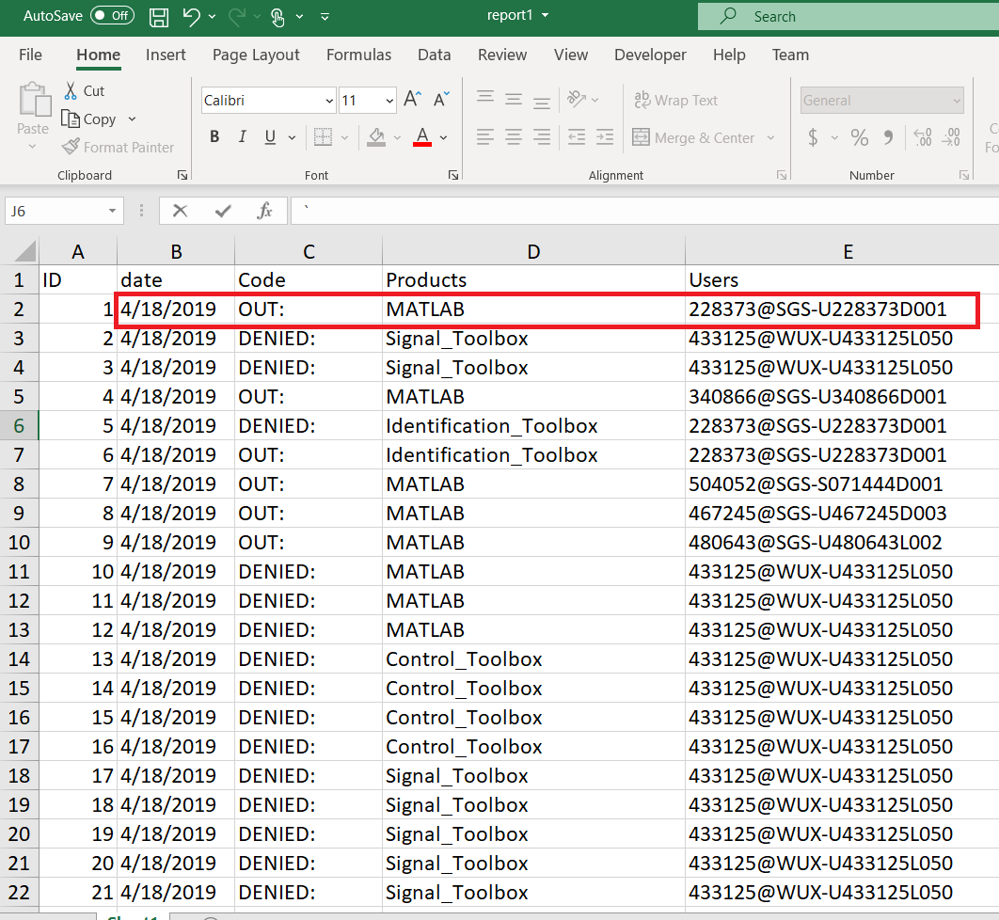
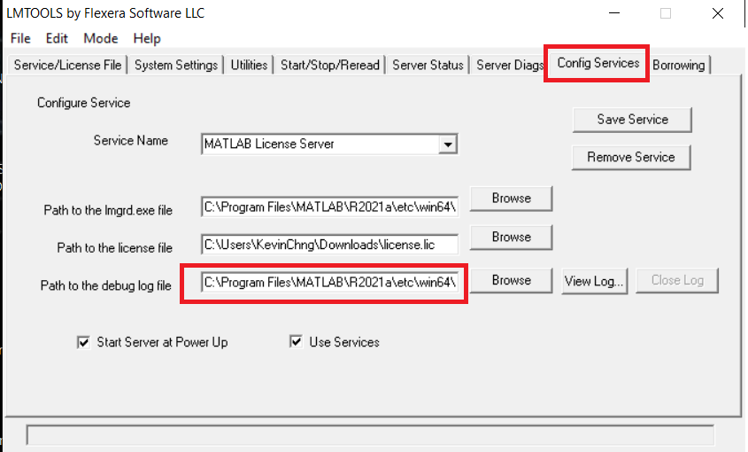

## Monitoring the Network License Usage of MATLAB (Drafting)
Authors : Kevin Chng (Email Address : kevin.chng@techsource-asia.com)

In MATLAB, there are 2 main types of Network Licenses which are Network Named User License (NNU) and Concurrent User License (CCU). 
For managing a group/large quantities of MATLAB licenses, understanding the usage of licenses is important as it could be the decisive factor for your license renewal or purchasing.
Besides, you could optimize the usage of license by allocating the NNU license to heavier user.

Below is the output of this github:

 
 

     
 
   

It has the information of date, staus of license checkout, toolbox and user. It is organized tabulated information to allow you to do further analysis in excel or any other programming language.

---

## SECTION 1 : Get the server log file and option file from license manager
In your license server machine, open lmtools (Consult your server engineer/license administrator if you don't know the location)
by default, it is located in MATLAB_Installation_rootfolder\MATLAB_version\etc\win64 (Window) or MATLAB_Installation_rootfolder/MATLAB_version/etc/glnxa64 (linux).

 
 

After opening Imtools, you can get the location of log file as follows:

 
 

     
 
     

if your network license has option file (which is for Network Named User License), you may find the location in your license file.
In your license file, you may take note the 2nd line which has the path for your option file.

---

## SECTION 2 : Run Python/MATLAB Script to mine the useful information from log file
In this section, I have written scripts in MATLAB and python to mine the information from the log file.
Therefore, you could select the programming as your desired. It might require some modification as I have not yet perform bulk testing to verify both script.

they are 2 parts : Monitoring the usage with/without option file.
If your network license is soley CCU or NNU, you are only required to perform part 1. 
if your network license is merged from both CCU and NNU, part 2 will help you to break the usage file into 2 files : CCU Usage and NNU Usage.

Take note : When you are running the script, kindly change the filename according to your own filename.

MATLAB Script : https://github.com/KevinChngJY/MATLAB_Monitoring_Network_License_Usage/blob/main/Script/Usage_Analysis.mlx  
Python Script : https://github.com/KevinChngJY/MATLAB_Monitoring_Network_License_Usage/blob/main/Script/Usage_Analysis.ipynb

---

## SECTION 3 : Use My WebApplication to perform this tasks
This app is unable to help you to break down the usage file into NNU (Network Named User) and CCU (Concurrent User) due to the limitation of processing power available in the server. Therefore, if you intend to break down it to CCU and NNU, you have to process the log file yourself using the MATLAB or Python script in this github.

Web Application : https://www.kevinchng.online/techsource_system/network_license_usage_analysis

---

## SECTION 4 : Seek for help
I'm dont guarantee that I'm free to help everyone or reply everyone, however, if i'm free, I'm always happy to help.
